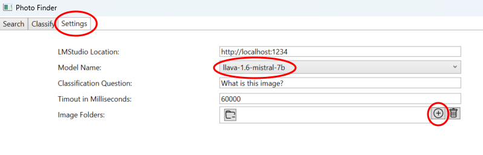
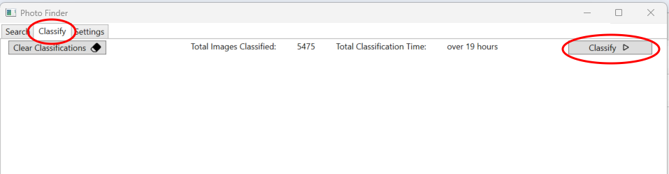

# PhotoClassification

A widnows application that uses the LM Studio API to classify and describe image files with local AI then allows keyword searches to be performed to quickly find images.

## Installation

### Overview
The app uses [LM Studio](https://lmstudio.ai/) to classify the images, so this must be installed and configured first before any classification can be done (however, once classification is complete, searches do not need a conneciton to LM Studio).

In my testing I used the **llava-1.6-mistral-7b** model which produced impressive results for me while taking 10 to 15 seconds to index an image.
This was on a system with 64Gb RAM and a 16Gb graphics card, so you may want to experiment with other models for better performance.

### Step by Step

1. Download and install [LM Studio](https://lmstudio.ai/).
1. Open LM Studio and select the Discover Icon on the left of the screen
1. Search for the "llava-1.6-mistral-7b" model (or you can use any other model with the "Vision Enabled" tag) and download it
1. Click the "Developer" icon on the left and click "Select a model to load", then select the model you downloaded above
1. Make sure the "GPU Offload" is set as high as your GPU can support (0 if you don't have one!)
1. Click "Remember Settings" and then "Load Model"
1. Make sure status is set to "Running" in the top left
1. Download the latest [PhotoFinder.zip](https://github.com/ruairiohagan/PhotoClassification/releases/tag/v1.0.0.1) from the releases area
1. Unzip the file into a new folder and run the "PhotoFinder.exe" application.
1. Check that the model you downloaded above is visible in the "Model Name" drop down and select it. 
1. Use the "+" button to add folders to search for images - they will be searched recursively by default.
1. Select the "Classify" tab and click "Classify" to start processing your images :) 

Images and their generated description will be shown as they are processed on the classify tab.

If you want an image's description to be regenerated (e.g. if you change model), simply delete the corresponding text file in the images folder and click "Classify" again.

Classification will only be performed on images that don't have a corresponding txt file containing the description.

Then when you have images classified you can use the search tab to do keyword searches.

